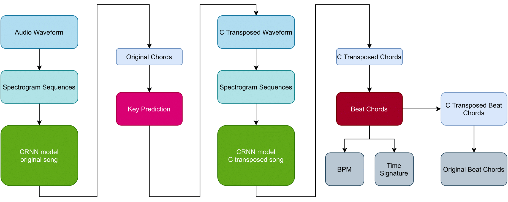

# Song Chords Recognizer - Pipeline

Song Chords Recognizer based on Deep Learning and statistical models coded and [trained](../SongChordRecognizer_Training/ReadMe.md) in Python.

### Prerequisites
 - Python 3.8
 - python libraries - sklearn, tensorflow, librosa, mir_eval
 - [SongChordRecognizer_Training folder](../SongChordRecognizer_Training/ReadMe.md)

## Usage
You can check the [Jupiter Notebook Demo](./Bachelor%20Research%20-%20Demo.ipynb).
### Shell 
```shell
python SongChordsRecognizer.py
```
 - Standard Input ->
    ```shell
    {
        "Waveform": [SONGs WAVEFORM],
        "SampleRate": [WAVEFORMs SAMPLE RATE]
    }
    ``` 
   - Example
        ```shell
        {
            "Waveform": [0.3215, 0.1235, 0.6213, -0.941, 0.523],
            "SampleRate": 44100
        }
        ```
 - Standard Output ->
    ```shell
    {
        "Key": [KEY DESCRIPTION],
        "BPM": [BPM VALUE],
        "ChordSequence": [LIST OF CHORDS],
        "BeatTimes": [LIST OF BEAT TIMES IN SECONDS],
        "BarQuarters": [NUMBER OF QUARTERS IN ONE BAR]
    }
    ```
    - Example
        ```shell
        {
            "Key": "C",
            "BPM": "120.323",
            "ChordSequence": ['A', 'B', 'A', 'A', 'C'], 
            "BeatTimes": [0.123, 0.32, 0.4, 0.55],
            "BarQuarters": 4
        }
        ```

## Structure



### Models

There are two [models](./models/ReadMe.md). The first one is trained on original songs. The second one is trained only on songs transposed to C ionion key and its mode alternatives. The transposed model has better accuracy score.

### Preprocess

Audio waveform is preprocessed to the 23s long sequences of cqt spectrograms.

### Key Prediction

Based on already predicted chords, the key with the most fitting chords is choosed. Each key has seven corresponding chords that are checked.

### Beats Voting

This part uses librosa library to get the BPM value and the Beats list.
We use two approaches

1. Each beat duration is summarized and the most common chord is the one mapped to this beat.
1. The BPM is used to estimate how many chords correspond to one beat. After that we precreate first draft of beat chord sequence where each chord corresponds to some beat. This sequence is used for the tempo signature estimation. After that we supply or remove missing chords or single chords to complete full bar of the same chord. 

We proceed with the second approach that seems to be more accurate.

